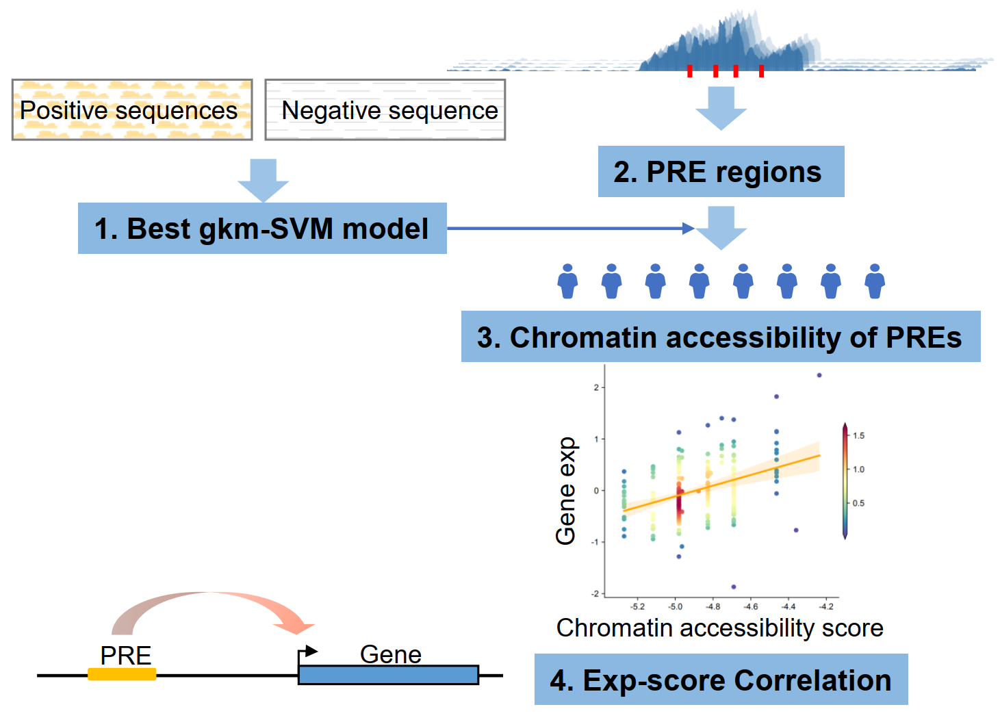

# eQTac
EQTac is a method to predict the potential regulatory elements (PREs) and their target genes, based on the eQTL datasets, the only additional data was ATAC-seq or ChIP-seq peak data. 
## Schematic 

## Dependence
### Python packages
```
numpy >= 1.21.6
pandas >= 1.2.3
pybedtools >= 0.8.1
pysam >= 0.15.3
rpy2 >= 3.5.11
scipy >= 1.7.3
```
### Other software (need manual installation)
```
plink >= v1.90b6.24 (not plink2, plink should in $PATH)
bedtools >= v2.30.0 (bedtools should in $PATH)
R >= 3.6.1
    r-gkmSVM >= 0.8.0
```
## Installation & test example
```
# installation
pip install eQTac 

# test examples
git clone https://github.com/JFF1594032292/eQTac.git # just for test
cd eQTac/Utilities_pipeline
nohup sh example_All_pipeline.sh &
```
Then it will generate an `output_eQTac` folder, which contained results file `test.geno.vcf.gz.PRE_score.eQTac_result.FDR.txt`. (example takes 3~5min)

## Input data
1. Data used in model training:
    1. **Positive sets in bed format.** It's usually the peak data from ATAC-seq or ChIP-seq, we recomended to trim peaks to the core region (e.g. summits $\pm$ 100bp). See `test_data/test.positive.bed`.
<<<<<<< HEAD
    2. **Excluded sets in bed format.** It's usually the peak data from ATAC-seq or ChIP-seq, but with more relaxed thresholds (e.g. p=0.2). These region will be removed from genrated negative regions, in order to remove potential positive sequences from negative sets. See `test_data/test`.exclude.bed.
=======
    2. **Excluded sets in bed format.** It's usually the peak data from ATAC-seq or ChIP-seq, but with more relaxed thresholds (e.g. p=0.2). These region will be removed from generated negative regions, in order to remove potential positive sequences from negative sets. See `test_data/test`.exclude.bed.
>>>>>>> 4b8bfa95564736c3bf45c48056ea656cf880d680
    3. Fasta file with .fai index. Usually the human genome sequnce file in fasta format. See `test_data/test.hg19.chr17.fa`.
2. Data used in eQTac calculation.
    1. **PRE.bed**. The candidate regions used to assess chromatin accessibility scores across different individuals and then calculate correlation with target genes. See `test_data/test.pre.bed`.
    2. **Genotype data in plink format**. Individual genotype in eQTL datasets. See `test_data/test.geno.bed, test_data/test.geno.bim, test_data/test.geno.fam`.
    3. **Expression file**. The expresion values are normalized expression values (see GTEx) and already corrected for covariates. See `test_data/test.exp_residual`.
    4. Snplist file. SNP list file used in eQTac analysis. Note: only single nucleotide mutations. See `test_data/test.geno.snplist`.
## Usage pattern
We provided three level patterns: (1) pipeline level. (2) part level. (3) function level.
### Pipeline-level pattern
For the function level pattern, we provide a script: Part-All-eQTac_pipeline.py.
It can be used as `Utilities_pipeline/example_All_pipeline.sh`:
```
python Part-All-eQTac_pipeline.py \
	-p test_data/test.positive.bed \
	-ex test_data/test.exclude.bed \
	-pre test_data/test.pre.bed \
	--geno test_data/test.geno \
	--snp test_data/test.geno.snplist \
	-fa test_data/test.hg19.chr17.fa \
	-exp test_data/test.exp_residual \
	-n 100 \
	-o output_eQTac \
	-t 3 -l 10 -k 6 -c 10 -g 2 -e 0.01
```
### Part-level pattern
For the function level pattern, we provide four scripts:
```
Part-1-Train_model.py
Part-2-Generate_PRE_fa.py
Part-3-Predict_PRE_score.py
Part-4-Calculate_eQTac_correlation.py
```
It can be used as `Utilities_pipeline/example_Part_pipeline.sh`:
```
python Part-1-Train_model.py \
	-p test_data/test.positive.bed \
	-ex test_data/test.exclude.bed \
	-o output_eQTac_part \
	-t 3 -l 10 -k 6 -c 10 -g 2 -e 0.01

python Part-2-Generate_PRE_fa.py \
	-pre test_data/test.pre.bed \
	--geno test_data/test.geno \
	--snp test_data/test.geno.snplist \
	-fa test_data/test.hg19.chr17.fa \
	-o output_eQTac_part

python Part-3-Predict_PRE_score.py \
	-m output_eQTac_part/test.positive.pos.svmmodel.3_10_6_0.01.model.txt \
	-l output_eQTac_part/test.geno.snplist.bed--test.pre.bed.pre_snplist.ld_info \
	-mfa output_eQTac_part/test.geno.snplist.bed--test.pre.bed.pre_snplist.ld_info.snplist.bed.mutate.fa \
	-geno test_data/test.geno \
	-snp output_eQTac_part/test.geno.snplist.bed--test.pre.bed.pre_snplist \
	-T 1 \
	-o output_eQTac_part

python Part-4-Calculate_eQTac_correlation.py \
	-pre output_eQTac_part/test.geno.vcf.gz.PRE_score \
	-exp test_data/test.exp_residual \
	-n 50 \
	-o output_eQTac_part
```
### Function-level pattern
For the function level pattern, we provide a series of functions:
```
from eQTac.get_nullseq import get_nullseq
from eQTac.filter_bkg import filter_bkg
from eQTac.generate_snp_dict import generate_snp_dict
from eQTac.generate_PRE import generate_PRE
from eQTac.generate_mut_fa import generate_mut_fa
from eQTac.geno2score import geno2score
from eQTac.eQTac_correlation import eQTac_correlation
from eQTac.eQTac_permutation import eQTac_permutation
from eQTac.control_FDR import control_FDR
```
These functions can be used to construct the whole pipeline.
### Recomend
We recomend to use the **pipeline-level** pattern at first to make sure that all input formats are valid. 

Then use the **part-level** pattern to debug parameters. (e.g. training a best performance model). The first step is the most time-consuming step, we recomended to use the part-level pattern to save the SVM model `xxx.svmmodel.3_10_6_0.01.model.txt`.

If you are familiar with this pipeline, you can directly use the **function-level** pattern to construct your own pipeline.
## Notes
1. The test result is very volatile, because of the small size of test dataset (only ~6MB length of sequences). The results will be stable with tens of thousands or more peaks used as positive set.
